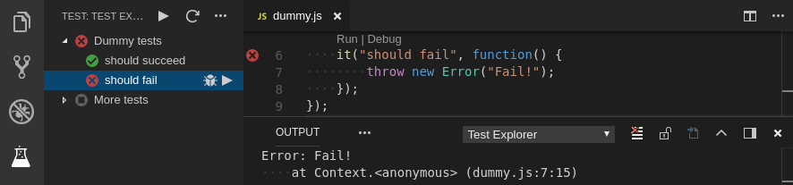

# Mocha Test Explorer for Visual Studio Code

Run your Mocha tests using the 
[Test Explorer UI](https://marketplace.visualstudio.com/items?itemName=hbenl.vscode-test-explorer).

## Features
* Shows a Test Explorer in the Test view in VS Code's sidebar with all detected tests and suites and their state
* Adds CodeLenses to your test files for starting and debugging tests
* Adds Gutter decorations to your test files showing the tests' state
* Shows a failed test's log when the test is selected in the explorer
* Lets you choose test suites or individual tests in the explorer that should be run automatically after each file change

## Getting started
* Install the extension
* Restart VS Code and open the Test view
* Run / Debug your tests using the  /  icons in the Test Explorer or the CodeLenses in your test file

## Configuration

The following configuration properties are available:

Property                        | Description
--------------------------------|---------------------------------------------------------------
`mochaExplorer.files`           | The glob describing the location of your test files (relative to the workspace folder) (default: `test/**/*.js`)
`mochaExplorer.env`             | Environment variables to be set when running the tests
`mochaExplorer.cwd`             | The working directory where mocha is run (relative to the workspace folder)
`mochaExplorer.ui`              | The mocha ui used by the tests (default: `bdd`)
`mochaExplorer.timeout`         | The test-case timeout in milliseconds (default: `2000`)
`mochaExplorer.retries`         | The number of times to retry failed tests (default: `0`)
`mochaExplorer.require`         | Module(s) that Mocha should require()
`mochaExplorer.exit`            | shutdown the Mocha process (using process.exit()) after the last test has been run (default: `false`)
`mochaExplorer.nodePath`        | The path to the node executable to use. By default it will attempt to find it on your PATH, if it can't find it or if this option is set to `null`, it will use the one shipped with VS Code
`mochaExplorer.monkeyPatch`     | apply a monkey patch to Mocha's `bdd`, `tdd` and `qunit` interfaces to get more accurate line numbers for the tests and suites (default: `true`)
`mochaExplorer.debuggerPort`    | The port to use for debugging sessions (default: `9229`)
`testExplorer.codeLens`         | Show a CodeLens above each test or suite for running or debugging the tests
`testExplorer.gutterDecoration` | Show the state of each test in the editor using Gutter Decorations
`testExplorer.onStart`          | Retire or reset all test states whenever a test run is started
`testExplorer.onReload`         | Retire or reset all test states whenever the test tree is reloaded

## Commands

The following commands are available in VS Code's command palette, use the ID to add them to your keyboard shortcuts:

ID                                 | Command
-----------------------------------|--------------------------------------------
`test-explorer.reload`             | Reload tests
`test-explorer.run-all`            | Run all tests
`test-explorer.run-file`           | Run tests in current file
`test-explorer.run-test-at-cursor` | Run the test at the current cursor position
`test-explorer.cancel`             | Cancel running tests

## Troubleshooting
If the Test view doesn't show your tests or anything else doesn't work as expected, you can turn on diagnostic logging using one of the following configuration options
(note: in multi-root workspaces, these options are always taken from the first workspace folder):
* `mochaExplorer.logpanel`: Write diagnotic logs to an output panel
* `mochaExplorer.logfile`: Write diagnostic logs to the given file

There is a [bug in Node >= 10.6](https://github.com/nodejs/node/issues/21671) that breaks this adapter.
If you're using a version of Node affected by this bug, add `"mochaExplorer.nodePath": null` to your configuration as a workaround.

If you think you've found a bug, please [file a bug report](https://github.com/hbenl/vscode-mocha-test-adapter/issues) and attach the diagnostic logs.
